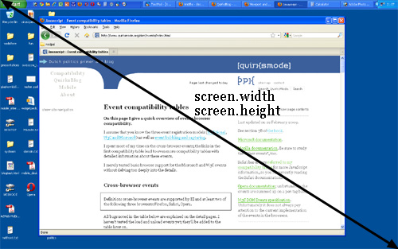

# 两个viewport的故事


原文：[A tale of two viewports — part one](https://www.quirksmode.org/mobile/viewports.html)
译：gdh51

大多数开发者可以直观的理解大多数的桌面应用开发相关的概念。在移动端，我们同样能找到相同的概念，但更加复杂，此时来讨论大家都知道的概念可以极大的帮助我们理解移动端浏览器。

## 概念：设备像素(device pixels)与CSS像素(CSS pixels)

第一个我们需要理解的概念是**CSS像素**和它与**设备像素**的不同之处。

设备像素是一种我们直观上认为“正确”的像素。这些像素表示你正在使用的设备的正确的分辨率，(通常来将)我们可以通过`screen.width/height`从浏览器中获取。

如果你赋予一个DOM元素`width: 128px`，同时你的显示器的宽度为`1024px`，此时你最大化你的浏览器窗口，那么该元素会以其八倍的大小来适配你的显示器。(大致是这样，让我们暂时忽略那些比较麻烦的问题)

如果该用户放缩屏幕，那么计算方式就会有变动。如果用户将屏幕放大为`200%`，那么这个`width: 128px`的元素只会以其四倍的大小来适配你的`1024px`的显示器。

现代浏览器中的缩放的实现仅仅被认为是“拉伸”了像素。即，该元素的**定义**的宽度并没有从`128`变为`256`像素，而是它真实的像素变成了其大小的两倍。正确的说，元素的宽度依然为`128`个CSS像素，即使它现在占用了`256`个设备像素。

换句话说，放大到`200%`导致1个CSS像素的大小等于4个设备像素的大小(2倍的宽和高，所以一共是4倍的面积)

这里会用一些图片来阐述这个概念。这里有4个像素在`100%`缩放时(即未缩放)。这里就没有什么好解释的，CSS像素完全覆盖了设备像素(即两者重合，1个CSS像素等于1个设备像素)


现在将其缩小。CSS像素此时开始收缩，这就意味着一个设备像素现在覆盖了多个CSS像素。


如果你此时不是缩小而是放大，那么将发生相反的情况：CSS像素开始扩大，最后的结果是一个CSS像素覆盖了多个设备像素。


>以上观点是基于我们只关注CSS像素来描述的。因为CSS像素描述了我们设置的样式表是如何渲染的。

设备像素在大多数情况下对我们开发者而言是完全没用的，但对用户来说并不是。用户可以缩放页面以便在合适的大小来进行阅读。然而，用户的缩放缩放对开发者来说并不重要。浏览器会自动确保开发者的CSS布局被拉伸或压缩。

### 100%缩放(即未缩放)

我们的上述的例子是基于一个假设：当前缩放等级为100%。现在是时候来更加严格的定义它了;

|当未进行缩放时，一个CSS像素是完全等于一个设备像素的|
-

在接下来解释概念的例子中，100%缩放将变得非常好用，但开发者不用在日常工作时过渡担心它。在桌面应用开发时，开发者通常是在100%缩放等级下调试我们的页面，但即使用户放缩了页面，浏览器也会自动保证我们的页面布局拉伸或压缩。

## 屏幕尺寸(Screen size)

让我们来看一些实际的测量方式。我们从`screen.width`与`screen.height`开始。它们包含了用户显示器设备整个的宽度和高度。**这些尺寸是以设备像素来度量的因为它们永远不会改变**：它是设备的的特征，而非浏览器的特征。



Fun！但是我们能用这些信息来做些什么呢？

泻药，基本上没有。用户显示器设备的尺寸对我们来说不重要——好吧，除非你想把它用来作为一个web数据统计调研。

## 视窗大小(Window size)

相反，我们想要知道的是浏览器内部提供给用户窗口的大小。因为它能精确的告诉我们，**用户能在我们提供的CSS布局中看到多大的区域**。开发者可以通过`window.innerWidth`与`window.innerHeight`来查看这个大小。


显然，浏览器窗口的内部大小是用CSS像素衡量的。我们需要知道，我们整个布局的视图中，有多少部门能够从这个窗口呈现出来，同时，随着用户缩小屏幕，这个空间还会不断的减小。所以，如果如果用户缩小屏幕，那么我们整个布局视图在浏览器视窗中出现的空间就越小，同时`window.innerWidth`与`window.innerHeight`也会减少。(PS:这两个字段在有滚动条时，包含滚动条的高端)

(~~不过上面的这个情况在Opera浏览器中是个例外，随便用户怎么放缩页面，该值也不会改变~~，先已修复该BUG)


> 注意这里的测量宽度和高度包含滚动条的宽高，它们也被考虑进了浏览器视窗的一部分(这主要是浏览器的历史原因——浏览器大战)

## 滚动位移(Scrolling offset)

`window.pageXOffset`与`window.pageYOffset`包含了相当于文档元素垂直和水平方向的位移大小。因此我们可以通过它来得出用户滚动了多少页面。


这些属性也是通过CSS像素来衡量的。你可以通过它知道文档已经滚动了多少，无论它处于什么缩放状态。

理论上来说，如果用户向上滚动然后放大屏幕，`window.pageX/YOffset`是会改变的。但是浏览器试图通过在用户缩放时，将相同的元素保留在可见页面的顶部达到保持web页面的一致性的效果。这样做不总是奏效，但它意味着实际上`window.pageX/YOffset`并没有改变：被滚动出当前视窗的CSS像素的数量仍然(粗略地)保持不变。


(译者：从上面这两个图我们可以看到，在放缩时，在视窗顶部的元素始终在顶部。在实际测试中，只要放缩不影响到布局的改变，那么滚动条位置就不会变)

## viewport的概念

在我们继续了解更多`Javascript`属性之前，我们必须先介绍另一个概念：`viewport`(视口)

`viewport`是用来约束`<html>`元素的，它是一个网站的最顶级的包含块。

这个听起来可能有点模糊，所以这里给出一个实际的例子。假设你有一个流式布局，同时其中一个侧边栏有一个`width: 10%`属性。现在当你调整浏览器窗口大小时，侧边栏会整齐地收缩和增长。那么它是怎么工作的呢？

从技术层面上讲，侧边栏获得了其父元素宽度的`10%`。假设这个父元素是`<body>`(此时我们并没有在其上定义任何`width`属性)。那么问题就变成了，`<body>`元素的`width`是什么？

正常情况下，所有的块级元素的默认宽度为其父元素宽度的`100%`(当然也有特殊情况，这里我们忽视这些特殊情况)。所以`<body>`元素就和其父元素一样宽，即父元素为`<html>`元素。

那么`<html>`元素的宽度呢？为什么它的宽度同浏览器的可视窗口一样。那就是为什么你的设置为`width: 10%`的侧边栏会横跨整个浏览器可视窗口宽度的`10%`。所有web开发人员都直观地知道并使用这个事实。

你所不知道是这个理论是如何运作的。从理论上将`<html>`元素的宽度受到了`viewport`宽度的限制。`<html>`元素占据`viewport`宽度的`100%`。

反过来，`viewport`和浏览器的可视窗口是完全相等的：它就是这样被定义的。`viewport`不是HTML结构中的一员，所以我们不能通过`CSS`来改变它。它仅仅是拥有浏览器可视窗口的宽和高——在桌面应用中。在移动端应用中，它变得更加复杂。

### 后果

这些情况就导致了一些奇怪的后果。你可以看到该网站右上角的这个图标。首先将网站滚动到最上，然后放大2~3步，之后你就会发现右上角的文字图标被挤出了浏览器窗口。

现在滚动到最右边，你就可以看到网站顶部的这个蓝色条再也不正常对齐了。


这个行为就是`viewport`定义的结果。我给顶部的这个蓝色条定义了`width: 100%`，那么这个`100%`代表的是谁的`100%`？它就是`<html>`元素的`100%`，`<html>`元素的宽度就和`viewport`/浏览器可视窗口一样。

重点是：当所有元素在100%缩放下正常工作时，现在我们将网页放大，`viewport`就会变得比我们整个网页的宽度更小。这本身并不重要，内容现在从`<html>`元素溢出，但该元素有`overflow: visible`，这意味着溢出的内容将在任何情况下显示。

但是这个蓝色的条却没有溢出。我赋予它`width: 100%`，毕竟，浏览器遵守赋予该元素`viewport`的宽度的规则。他们不关心这个宽度现在是否太窄了。


### 文档宽度(document width?)

我真正关心的是页面整个内容的宽度，包括突出的那一部分。就我目前所知，现在还不能求出那部分的值(当然，除非你通过一个个元素去计算，但这容易出错)

我坚信我们需要一个`Javascript`属性来为我们提供我所说的“文档宽度”(当然是CSS像素层面的)


如果我们真的觉得很funky，为什么不同样暴露一个“文档宽度”的值给CSS样式？我肯定会将页面上这个蓝色条的`width: 100%`基于“文档宽度”来定义，而不是`<html>`元素。(这肯定很难，即使这不能实现我也不会奇怪)

浏览器开发商，你们觉得怎么样？

## 测量viewport

你想测量`viewport`的尺寸。它们能通过`document.documentElement.clientWidth`与`document.documentElement.clientHeight`获得。


如果你了解`DOM`，你就会知道`document.documentElement`事实上就是`<html>`元素；`HTML`文档的根元素。但是，`viewport`比它还更高一层，可以说，它是一个包含`<html>`元素的元素。这就意味着，如果你给`<hmlt>`元素定义一个`width`，就会产生一些影响。(我不推荐这种做法，但这确实可行)

**这种情况下，`document.documentElement.clientWidth`与`document.documentElement.clientHeight`还是表示`viewport`的大小，而不是`<html>`元素**。(这是一个特殊的规则，只适用于这个元素，只适用于这个属性。在其他情况下，都使用元素的实际宽度)


因此，`document.documentElement.clientWidth`与`document.documentElement.clientHeight`总是返回`viewport`的大小，不管`<html>`元素的大小是多少。

### 两对属性

那么我们是否能通过`window.innerWidth`与`window.innerHeight`来获得`viewport`的大小呢？答案是，能也不不能。

它们之间有一个形式上的区别：`document.documentElement.clientWidth`与`document.documentElement.clientHeight`并不包括滚动条的宽高，而`window.innerWidth`与`window.innerHeight`是包含的。不过，这几乎也谈不上什么差别。

为什么我们会有两对这样的属性是因为当初浏览器大战遗留下来的。那时`Netscape`只支持`window.innerWidth`与`window.innerHeight`。IE只有
它们之间有一个形式上的区别：`document.documentElement.clientWidth`与`document.documentElement.clientHeight`。从那以后，所有其他浏览器都开始支持`clientWidth/Height`，~~但IE没有支持`window.innerWidth/Height`~~(已支持)。

在桌面上有两对属性的存在可能是一个小麻烦，但在移动设备上却是件好事，我们等会将看到这一点。

## 测量HTML元素

所以在所有的例子中`document.documentElement.clientWidth`与`document.documentElement.clientHeight`返回`viewport`的大小。那么我们能从什么地方获取`<html>`元素的大小呢？它们被存储在了`document.documentElement.offsetWidth`与`document.documentElement.offsetHeight`


这个属性是真实连接到`<html>`元素的如果我们设置一个`width/offsetWidth`那么将会反应到`<html>`元素上。


## 事件的坐标

这里还有一些事件的坐标：当一个鼠标事件发生时，超过5对属性关于事件发生的位置信息会暴露给开发者。我们这里只讨论其中三对比较重要的：

- `pageX/pageY`给出相对于`<html>`元素的坐标(CSS像素单位)
- `clientX/clientY`给出相对于`viewport`的坐标(CSS像素单位)
- `screenX/screenY`给出相对于屏幕的坐标(设备像素)


你会在90%的时间中使用`pageX/pageY`属性；通常你想知道事件的相对于文档的位置信息。剩余的10%的时间你会使用`clientX/clientY`。你永远不会也不需要去使用基于显示器信息的坐标。

## 媒体查询

最后，一些媒体查询的关键词。这个想法很简单：你可以定义特殊的CSS规则，只有当页面的宽度大于、等于或小于一定的大小时才执行这些规则。举个例子：

```css
div.sidebar {
	width: 300px;
}

@media all and (max-width: 400px) {
	// styles assigned when width is smaller than 400px;
	div.sidebar {
		width: 100px;
	}
}
```

现在`sidebar`是`300px`宽，除非`width`比`400px`小，`sidebar`才会变成`100px`宽。

这里的问题就是：**`width`表示的是谁的`width`**？

这里有两对相关的媒体查询：`width/height`和`device-width/device-height`。

- `width/height`使用同`document.documentElement.clientWidth`与`document.documentElement.clientHeight`同样的值(换句话说就是`viewport`)。它使用CSS像素做单位。

- `device-width/device-height`使用同`screen.width/screen.height`同样的值(换句话说就是显示器)。它使用设备像素做单位。


你会使用哪一个？显而易见：`width`。开发者并不对设备宽度感兴趣；它们只关心浏览器可视窗口的宽度。

因此使用`width`并忘掉`device-width`——在桌面应用中。正如我们将看到的，在移动设备上的情况要复杂得多。

## 总结

以上部分总结了对桌面应用行为的总结。[第二部分](https://www.cnblogs.com/nzbin/p/5721743.html)将会这些概念移植到移动端，并强调它与桌面应用的一些区别。
